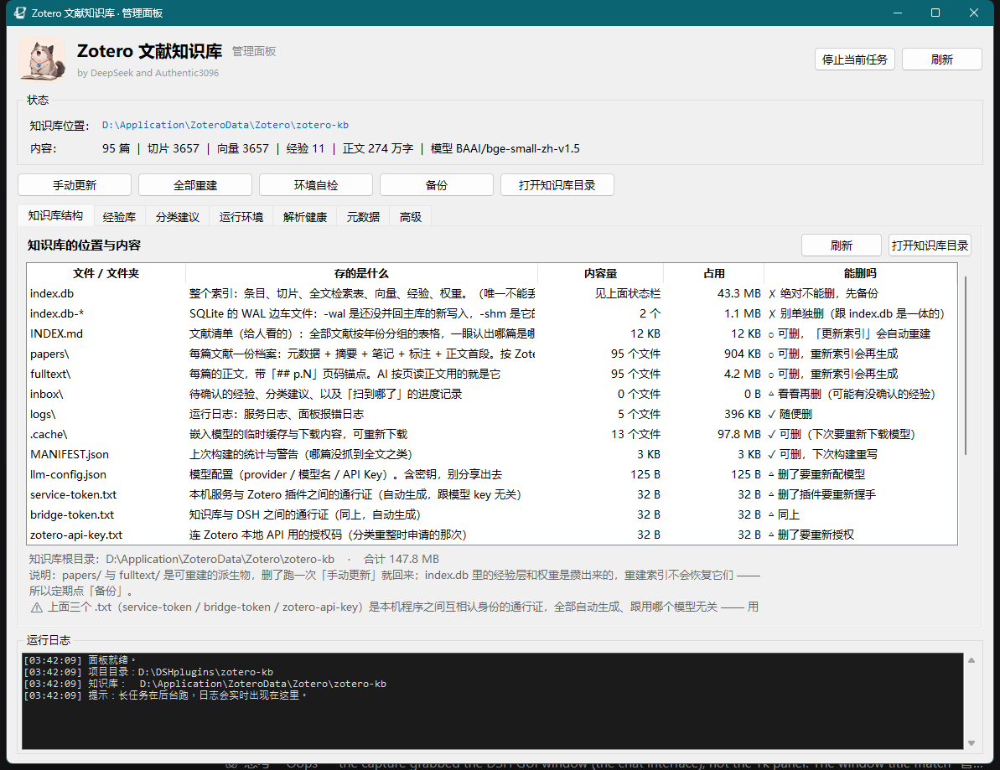
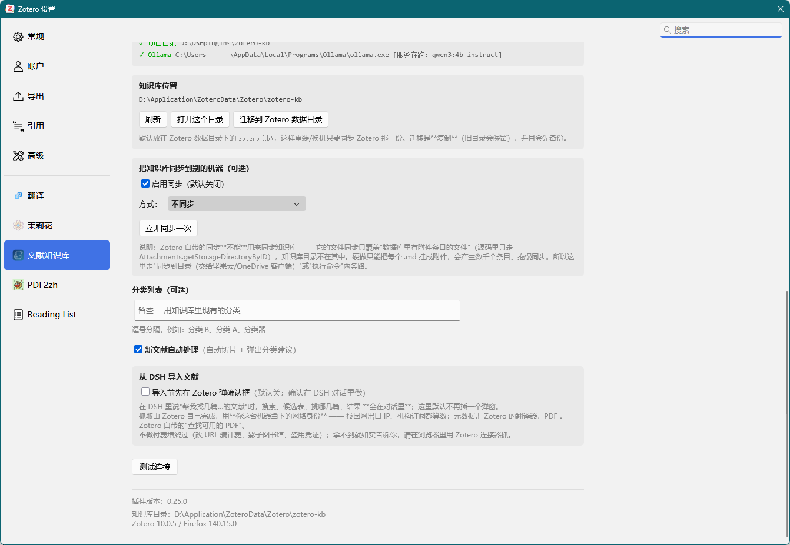
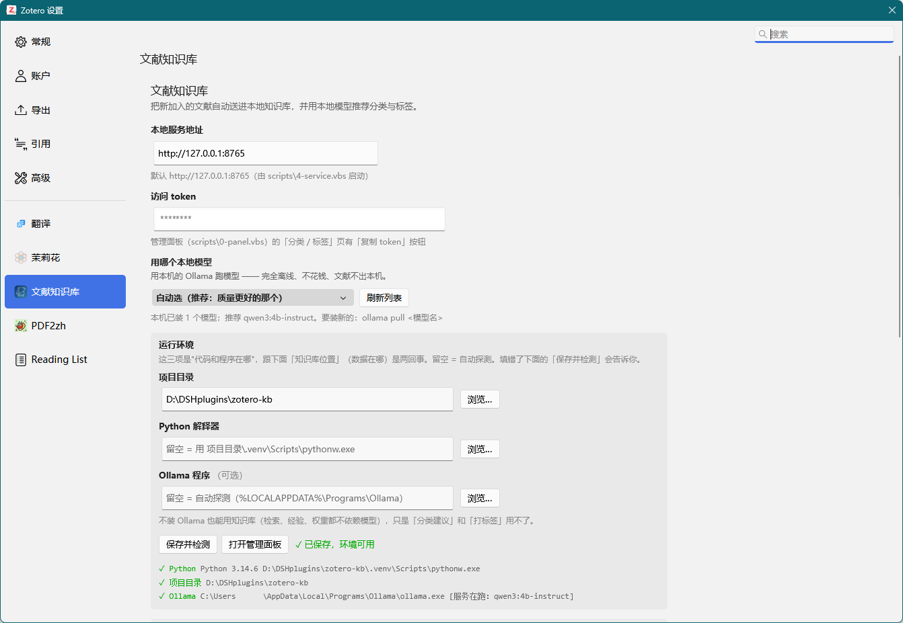

# Zotero 文献知识库

**把 Zotero 里的文献，变成 AI 能秒查、能按页精读、并且越用越准的本地知识库。**

文献存在 Zotero 里，但 AI 用不上 —— 它不知道你库里有什么、读了也记不住哪篇讲过什么、
更不知道你**试过哪些方法、哪条路走不通**。这个项目把这条链路打通，
**全程在本机完成**（只有"搜新文献"那一步需要联网）。

```
① 找文献  →  ② 抓进 Zotero  →  ③ 拆成知识库  →  ④ 喂给 AI  →  ⑤ 经验回流
```

⑤ 的经验会**回流到 ④**：下次检索时，"验证过有效"的文献自动排到前面 ——
这是整套系统里唯一会自我改进的一环。

## 它能做什么

1. **一句话搜到相关文献** —— 关键词 + 语义两路混合，中英文都行，返回**带页码的原文片段**
2. **按需精读某一篇** —— 按页取正文（不是整篇塞进上下文）、图表注单独可查
3. **找新文献并抓进库** —— 搜 → 列候选表（标题可点开看原文）→ 你勾选 → 进 Zotero，
   不用下载再手工拖。抓取交给 Zotero 自己，**校园网与机构订阅的权限天然生效**
4. **记住用过的经验** —— 上次试过哪几篇、哪个有效、哪个因为初值敏感失败
5. **越用越准** —— 验证有效或标为重点的文献，下次检索自动排前

## 界面

**管理面板**（双击 `scripts\0-panel.vbs`）—— 知识库结构一目了然：每个文件都写清
「是什么、占多大、**能不能删**」：



**Zotero 里的插件设置**（Zotero → 编辑 → 设置 → 文献知识库）：

| 知识库位置与自动处理 | 本地模型与运行环境 |
|---|---|
|  |  |

## 为什么比"把 PDF 丢给 AI"强

| | 直接把 PDF 丢进对话 | 只用 Zotero 自带的搜索 | **本方案** |
|---|---|---|---|
| 上下文成本 | 每次重传，长文直接爆 | — | 建库一次，之后**按需取页** |
| 能搜到的范围 | 只能搜你此刻记得的那篇 | 只匹配标题/作者/年份，**搜不到正文内容** | 关键词 + 语义**两路混合**，中英文都行 |
| 精度 | 模型现场读，读到哪算哪 | — | 返回**带页码的原文片段**，可回溯核对 |
| 跨对话记忆 | 换个对话就忘 | — | 经验层持续累积，**影响下次排序** |
| 数据去向 | PDF 上传到云端 | 本地 | **全本地**：切片、向量、模型都在你自己机器上 |

几个具体场景：

- **"我库里有没有讲过 XX 的？"** → 混合检索直接给带页码的片段，不用自己回想是哪篇
- **"这几篇的方法有什么区别？"** → AI 按页读正文 + 查图表注，而不是靠摘要猜
- **"这个方法我试过了吗？"** → 经验层回答"试过、什么条件、有效还是无效、为什么"
- **"这个方向还有哪些新文献？"** → 对话里搜 → 列候选（带摘要与被引）→ 勾选 → 进库 → 立刻可搜

## 快速开始

```powershell
# 1. 拿到项目（不想装 git 就去 Releases 下 Source code zip 解压）
git clone https://github.com/Authentic3096/zotero-kb.git D:\zotero-kb

# 2. 一键装 Python 环境 —— 本机没装 Python 也行，它会自己下载一个
D:\zotero-kb\scripts\install-env.cmd

# 3. 建知识库
D:\zotero-kb\scripts\1-convert.cmd

# 4. 装 Zotero 插件：下载 Releases 里的 xpi →
#    Zotero → 工具 → 插件 → 右上齿轮 → Install Plugin From File… → 重启 Zotero
```

完整步骤（含**验证装好了没**、日常使用、常见问题、卸载）见 **[INSTALL.md](INSTALL.md)**。

**环境**：Windows ｜ Zotero 7 ~ 10（实测 10.0.5）｜ Python 3.12+（第 2 步会自动装）
｜ 本地模型可选：Ollama + `qwen3:4b-instruct`，只用于分类建议与打标签，**不装不影响检索**。

> 不接 AI 也能用：管理面板（Tk）+ Zotero 插件可独立工作。
> 接 AI 的部分走标准 **MCP**（13 个工具 + 4 个资源），任何支持 MCP 的客户端都能接，
> DSH 是一条已经打通的路径。

## 文档

| 文档 | 讲什么 |
|---|---|
| [INSTALL.md](INSTALL.md) | **从零装到能用**：四步安装、验证、日常使用、常见问题、卸载 |
| [ARCHITECTURE.md](ARCHITECTURE.md) | 架构总览 + **关键功能的实现方式**：正文从哪来、检索怎么算分、经验权重公式、插件机制 |
| [docs/DESIGN.md](docs/DESIGN.md) | 设计与用法详解：为什么这么做、各功能怎么用、边界与已知限制 |
| [docs/DEVELOPMENT.md](docs/DEVELOPMENT.md) | 给改这个项目的人：目录结构、当前进度、**发版流程**、排错、后续计划 |

## 边界（明确不做什么）

说清楚边界和说清楚能力一样重要：

| 不做 | 原因 |
|---|---|
| **不写 `zotero.sqlite`** | Zotero 没开放写接口，直写会损坏库；写操作一律走它自己的 API |
| **不替你决定** | 分类与标签只给**建议**，要不要应用由你点 |
| **不把整篇正文塞给模型** | 先搜后读、按页取；否则上下文会爆 |
| **不做云端同步** | 全在本机（Zotero 自己的同步不受影响） |

完整的边界清单与已知限制见 [docs/DESIGN.md](docs/DESIGN.md)。

## 许可证

[MIT](LICENSE) © 2026 Authentic3096

打包分发的 Zotero 插件（`zotero-kb-*.xpi`）与本仓库内的 Python 代码、DSH skill
适用同一许可证。Zotero 本身是独立的第三方软件（AGPL-3.0），本项目只通过其公开
扩展接口调用，**不包含也不修改 Zotero 源码**。
